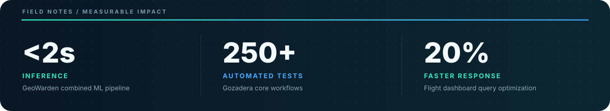
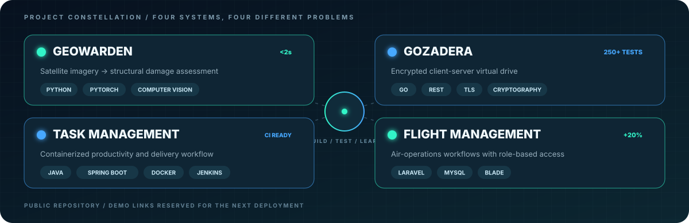
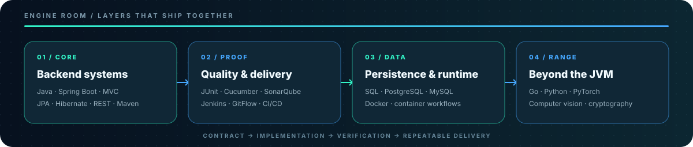

<div align="center">
  
</div>

<div align="center">
  <a href="mailto:pepoychris@gmail.com"></a>
  <a href="https://www.linkedin.com/in/christian-ortiz-belmonte"></a>
  
</div>

## `01 // SIGNAL`

> **I turn backend requirements into reliable paths for data:** explicit contracts, tested behavior and repeatable delivery.

```yaml
christian:
  role: "Backend Software Engineer"
  current_mission: "Financial microservices at NTT DATA"
  coordinates: "Alicante, Spain"
  engineering_focus:
    - "Java + Spring Boot services"
    - "REST APIs and persistence"
    - "Automated integration and behavior tests"
    - "CI/CD pipelines with quality gates"
  wider_range: ["Go", "Python", "PyTorch", "Computer Vision"]
  education: "BSc Computer Engineering · Software Development"
  languages: ["Spanish · Native", "Valencian · C1", "English · B2"]
```

<div align="center">
  
</div>

## `02 // PROJECT BAY`

<div align="center">
  
</div>

<details>
  <summary><strong>🛰️ GeoWarden · Computer vision for disaster analysis</strong></summary>
  <br />Compares pre- and post-disaster satellite imagery and generates structural-damage assessments. Separate building-segmentation and damage-classification models feed a combined inference pipeline optimized to run in under two seconds.
</details>

<details>
  <summary><strong>🔐 Gozadera · Secure virtual drive</strong></summary>
  <br />HTTPS REST API, interactive CLI, bbolt persistence and hybrid storage. Security layers include Argon2id, AES-256-GCM, Ed25519 signatures and X25519 end-to-end messaging, with more than 250 automated tests covering core workflows.
</details>

<details>
  <summary><strong>⚙️ Task Management · Containerized delivery</strong></summary>
  <br />Productivity application built with Spring MVC, Spring Data JPA and Thymeleaf, packaged with Docker and supported by Jenkins automation for continuous integration and repository quality.
</details>

<details>
  <summary><strong>✈️ Flight Management · Role-aware operations</strong></summary>
  <br />Air-operations web application with CRUD workflows, advanced authentication and role-based access control. Relational query optimization reduced the main dashboard response time by 20%.
</details>

<!--
PROJECT CARD TEMPLATE
Duplicate one <td> block above, then replace:
1. Project name and one-line outcome
2. What makes the engineering interesting
3. Technology tags
4. A real repository/demo/case-study link
-->

## `03 // ENGINE ROOM`

<div align="center">
  
</div>

<p align="center">
  &nbsp;&nbsp;
  &nbsp;&nbsp;
  &nbsp;&nbsp;
  &nbsp;&nbsp;
  &nbsp;&nbsp;
  &nbsp;&nbsp;
  &nbsp;&nbsp;
  &nbsp;&nbsp;
  &nbsp;&nbsp;
  &nbsp;&nbsp;
  &nbsp;&nbsp;
  
</p>

<p align="center"><sub>Designed as a mission console: original self-hosted artwork, no generated profile template, no inflated metrics.</sub></p>

